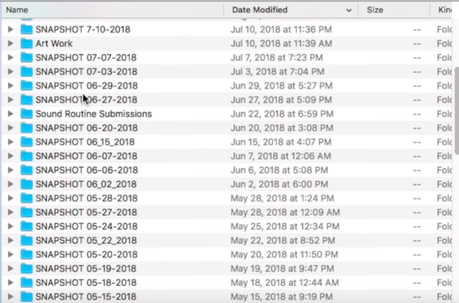
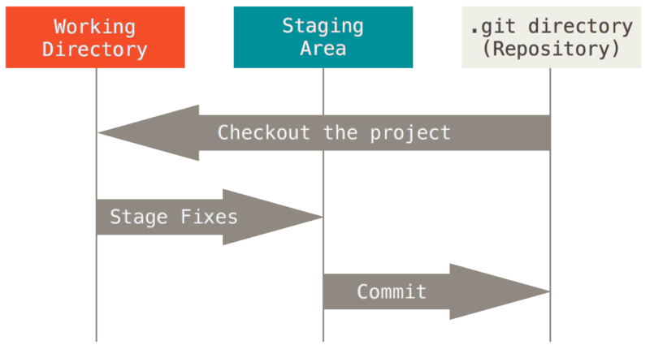

# Introduction to git

In this section you will learn the basics of Git. We will cover all the  necessary terminology and commands, so that you become a proficient Git user. **It is important that you follow this introduction if you have not used Git before!** The following sections will either expand on the concepts first  introduced here or will make use of them on multiple occasions.

## In this section you will learn

- [**What version control is and where Git fits**](#1-version-control-and-git)
- [**Basic git terminology**](#2-basic-git-terminology-and-operations)
- [**How to download the code**](#3-creating-and-getting-a-git-repository)
- [**How to change the code**](#4-changing-a-git-repository)
- [**How to track the changes to the code**](#5-tracking-git-repository-changes)

## 1. Version control and Git

First of all we need to explain what version control is. There are [**many**](https://www.atlassian.com/git/tutorials/what-is-version-control) [**detailed**](https://about.gitlab.com/topics/version-control/) [**explanations**](https://en.wikipedia.org/wiki/Version_control), but we will keep it simple. We can see it and use it as a way of keeping track of changes to your files in a clearly defined way. Importantly, we can access the history of these changes and obtain details of the changes done to the files over time. Modern version control systems also provide tools that enable code sharing, making working in a collaboration **easier and safer**.

For example, **this is not version control** (extreme example):



- false sense of security - easy to delete important things
- easy to make changes in a wrong directory
- not suitable for collaborations
- impossible to find that right version of algorithm you wrote 3 months ago
- there are tools that make it easy

Git is one of many version control systems available. It is arguably one of the most popular solutions and is used in a range of projects from academia to industry. Even though we are here for Git today, you should be aware of other version control systems that are still in use today (some more popular than the others):

| VCS | Quick description |
|---|---|
| CVS | One of the first version control systems. <br>Pretty much dead, but some projects still insist on using it. |
| Mercurial | Fairly similar to Git, but can be considered a bit more limited |
| SVN | _De facto_ VCS in the past. Less popular these days, but some big projects still use it |
| + many more | Visit [**this Wikipedia page**](https://en.wikipedia.org/wiki/Comparison_of_version-control_software) <br> for an exhaustive list of the version control software from the past and the present

**Why Git?**

- works on Linux, Windows and macOS
- easy to install: all major Linux distributions have relatively new versions available (you can always build from the source code if the newest version is required), .exe installer for Windows and an installer for macOS
- uses command line interface (CLI) but GUIs are available
- **you need only a few commands to start**
- very difficult to permanently erase the data by mistake - you have to really try and be very specific
- works both locally and remotely

## 2. Basic Git terminology and operations

We will not be running any commands in this part just yet. Before we do that, there are a few concepts specific to Git that you have to be familiar with:

- **[git] repository/repo** - what this can mean can be different to what it **actually** means. Repository is the `.git` directory inside your working folder, which contains all the required repository files. Quite often though, when someone refers to 'a repository' they mean the whole folder which contains the files you are working on.
- **3 stages of your repository:**
  - ***modified*** - you made changes to some of your files, you saved them with your editor of choice (e.g. vim), but Git is not yet aware of them. It detects that something changed, but has not yet stored it in its long-term memory (a database)
  - ***staged*** - you tell Git which changes should be stored in the database next (you stage these files)
  - ***committed*** - Git takes all the staged files you ordered it to keep track of and stores their snapshots (how they look at that point in time) into the database
  
  Your workflow with Git should generally look something like this:
  
  (Image from the [**Pro Git book by Scott Chacon and Ben Straub**](https://git-scm.com/book/en/v2), released under [**Creative Commons Attribution Non Commercial Share Alike 3.0 license**](https://creativecommons.org/licenses/by-nc-sa/3.0/#) )
- **branch** - most of the time, code development is not linear: you change some things in one place, add a feature in another and maybe remove something in a completely different file. What if you have multiple collaborators working on separate features? In such a situation, they can all work on their own, personal versions of the code (branches), not modifying everyone else's contributions and possibly the production-ready code.
- **main/master branch** - this is the branch you want the world to see and use. It should only include files that you are confident other people will be able to use and use them without major issues. It should contain production-ready and working code **only** - if you need to add and test a new feature, create a separate branch for it.

## 3. Creating and getting a Git repository

So you have a new codebase or a document that you have just started working on and decided to start using Git to keep track of all the changes you make. As we have already mentioned, it is easy to start using Git and you need only a single command to start a repository for your project (yes, it's really that easy). Go to your project's directory and run:

```bash
$ git init
Initialised empty Git repository in ...
```

If you now check all the files, including the hidden ones (using `ls -a` command on Linux and macOS), you will see a new `.git` directory appear. **This is the place where all of the necessary information for your repository is kept.** You know how we said it is difficult to remove the data by mistake? Make sure that the mistake is not removing the `.git` directory, especially with the `rm -r` command, as that will delete all of your repository history if you do not store it securely somewhere else.

If you store your repository in a single place, you get all the advantages of version control, such as tracking the changes to your codebase over the time. However, you are still susceptible to losing all your data if for example your laptop gets damaged or stolen. That is why it is important to store your repository on a remote server, be it privately hosted or an existing solution such as GitHub or GitLab (these will be covered in detail in the next couple of sections).

How do you get this repository though? That is what a `clone` command is used for. If you have a link to the GitHub repository, for example your coworker shared a link with you to some amazing plotting library and wants you to have a look at the source code, you can download the contents of this repository with a single command:

```bash
$ git clone <repository link>
```

For example, to clone an official Git repository (using Git of course and hosted on GitHub), you should run

```bash
$ git clone https://github.com/git/git.git` (that's a lot of git's)
```

This command downloads the repository and automatically places it inside a `git` folder (don't confuse it with a `.git` folder, which contains all the information relevant to the version control).

By default Git will always create a folder with a name that is the same as the main folder name (in this case `git`). It is possible that you already have a folder named git, maybe with some training materials, but you still want to `clone` the official Git repository. Do you have to move your existing folder somewhere else? Rename it? These sure are viable options, but (arguably) the most convenient method is to force Git to use a different directory name:

```bash
$ git clone https://github.com/git/git.git mygit`
```

With this command we again get all the data from the official Git repository, but this time it is placed inside the `mygit` directory, making any moving or renaming of existing directories unnecessary.

When you `clone` a git repository, you do not have to run the `git init` again - the `.git` directory and all the required files are downloaded automatically.

## 4. Changing a Git repository

Just having a repository dost not change much - we need to make sure that Git keeps track of changes to important files and that these changes are stored safely. We can now check the status of our new Git repository (make sure you are inside the freshly initialised or cloned repoitory) with:
`git status`
and your output may look something like that (this is the output I got after running the above command inside the freshly-cloned git repository):
```
$ git status
On branch master
Your branch is up-to-date with 'origin/master'.

nothing to commit, working directory clean
```
This is not very exciting. It's time we make some changes to this repository and commit them, i.e. we store these changes in the snapshot, effectively creating a backup of your changes. Don't worry, we won't be actually breaking the official Git repository - all of our changes will be local.

Let's add a new file with your editor of choice, with a short message inside it (feel free to be more adventerous that that):
```
File hello.txt

Hello world!

```
So Git is keeping track of this file, right? Not exactly! Let's see what happens if we run the `git status` command again:

```
$ git status
On branch master
Your branch is up-to-date with 'origin/master'.

Untracked files:
  (use "git add <file>..." to include in what will be committed)

	hello.txt

nothing added to commit but untracked files present (use "git add" to track)
```

So Git knows that there is a new file present (`hello.txt`), but the file is in an **utracked** state. These are the files that are not stored by Git as part of your repository history. Git knows about them, but doesn't really care about keeping track of changes you make to these files. The above output is helpful not only in the way that it shows us which files are urrently not being tracked by Git, but also how to instruct Git to keep tract of this file from now on. We can explicitly add our file to the list of tracked files using command (and then checking the status of the repository):
```
$ git add hello.txt

$ git status
On branch master
Your branch is up-to-date with 'origin/master'.

Changes to be committed:
  (use "git reset HEAD <file>..." to unstage)

	new file:   hello.txt
```

I hope you can easily see the difference! Our file is no longer untracked, but instead will be commited the next time we record changes to our repository (the file is now ***staged***).

This change is however not permanently added to te repository history yet! To do that, we have to explicitly ***commit** the changes:

```
$ git commit -m "Commit message"
```
The commit message is a short description of the changes that have been made to the repository since the last commit. In our case, we hav eadded a single, very short file, so an equally short commit message *"Added a hello.txt file"* will suffice. However, if you are working on a larger project, possibly with multiple other developers and researchers, you will want to make your commit messages as informative as possible, to makse sure everyone can understand the changes made to the code without the need to dig through the source code unnecessariyl. Even if you are working on your own, **you will** forget all details after some time. It is always a good practice to include a short title for a commit and then underneath it to write a short paragraph detailing all the changes made in this commit.

If you ommit the `-m` option, Git will open the configured text editor of your choice where you can type your commit message. This is especially useful if you write descriptive commit messages as described above.


Now that we have commited our first changes to the repository, we can keep on working on it. Let's say I no longer want to just welcome the world, but would also like to pay it a small compliment:
```
File hello.txt

Hello beautiful world!

$ git status

On branch master
Your branch is ahead of 'origin/master' by 1 commit.
  (use "git push" to publish your local commits)

Changes not staged for commit:
  (use "git add <file>..." to update what will be committed)
  (use "git checkout -- <file>..." to discard changes in working directory)

	modified:   hello.txt

no changes added to commit (use "git add" and/or "git commit -a")
```

We told Git to keep track of this file and add to our commits, but now the file is not staged even though we explicitly told Git to track it? This is an important point! Git knows it has to keep track of these files, but they will not be commited automatically every time we make changes to them. And this is for a good reason. Imagine you work on multiple files at once, but only really want to commit changes to one file at a time, e.g. you want to have a clear history of your changes. By not autmatically adding all the tracked files into the mext commit, you don't have to keep on moving or removing your files, depending on which specific file you want to commit at a given point in time.

So now our `hello.txt` file is ***modified** but not yet staged. We can again run the `git add hello.txt` command to stage it manually, but this can get cumbersome if we want to include all of the modified files in the next commit. Instead, we can use an extra option for our `git commit command`:

```
$ git commit -a -m "Updated the hello.txt" file"
```

Here the `-a` option adds the `git add` stage implicitly before the commit and you do not have to do it manually. **Important note though**, this option stages **all the modified files** for the commit! So if the scenario described above applies to you, you still need to add only the files that you want explicitly!

## 5. Tracking Git repository changes

We have now made our first two commits. What if we had more than that? What if you have a project we worked on a while back and don't remember the changes we made months ago? If you remember our "version control" example at the very start, copying files between directories doesn't give us much information. Sure, we could keep separate text files with the changelogs, then develop a place to keep track of them and maybe a script to retrieve these changelogs... Luckily Git comes with these features and much more.

To view the commit history we can use:

```
$ git log

commit a16c465f37b1e8bed33f8994f37a54ecff7fdbaf (HEAD -> master)
Author: Mateusz Malenta <mateusz.malenta@gmail.com>
Date:   Sun Jan 16 18:26:48 2022 +0000

    Updated the hello.txt file

commit f85bcfd67968b47edbeb98cdc663913bfded6059
Author: Mateusz Malenta <mateusz.malenta@gmail.com>
Date:   Sun Jan 16 15:11:18 2022 +0000

    Added a hello.txt file

commit df3c41adeb212432c53d93ce6ace5d5374dc6e11 (tag: v2.35.0-rc1, origin/master, origin/main, origin/HEAD)
Author: Junio C Hamano <gitster@pobox.com>
Date:   Fri Jan 14 15:26:53 2022 -0800

    Git 2.35-rc1
    
    Signed-off-by: Junio C Hamano <gitster@pobox.com>

...

```
There is a lot of output. If you keep on holding ENTER, you can scroll through the entire history of Git, although it may take some time. `git log` might seem like a simple command, all it does at the end of the day is display your commit messages. It is however extremely powerful and comes with a lot of options. It is therefore important you familiarise yourself with the most common options or the options you think will be the most useful in your day-to-day work. Here we will only scratch the surface and introduce some of the most common and basic `git log` options, the full documentation, just for viewing commit history is around 50 pages long if pasted in a document.

As you have seen, for projects as big as Git, the length of history can be overwhelming. We are able to limit it though. The easiest option is the limit the output to the final *n* commits:

```
$ git log -1

commit a16c465f37b1e8bed33f8994f37a54ecff7fdbaf (HEAD -> master)
Author: Mateusz Malenta <mateusz.malenta@gmail.com>
Date:   Sun Jan 16 18:26:48 2022 +0000

    Updated the hello.txt file
```
As we can see, in this case we print out only the last commit. This can be useful if you want to refresh your memory and see the last few commits.

That might not be enough though. For example, what if we wanted to see the commits made in the last 3 weeks, as we remember about an important feature added during that time, but don't remember when exactly? `git log` has an option for that:

```
$ git log --since="3 weeks ago"

commit a16c465f37b1e8bed33f8994f37a54ecff7fdbaf (HEAD -> master)
Author: Mateusz Malenta <mateusz.malenta@gmail.com>
Date:   Sun Jan 16 18:26:48 2022 +0000

    Updated the hello.txt file

...

commit d30126c20d5899f128facbd33ecf27163efe1326
Author: Elijah Newren <newren@gmail.com>
Date:   Tue Dec 28 00:20:46 2021 +0000

    merge-ort: fix bug with renormalization and rename/delete conflicts
    
    Ever since commit a492d5331c ("merge-ort: ensure we consult df_conflict
    and path_conflicts", 2021-06-30), when renormalization is active AND a
    file is involved in a rename/delete conflict BUT the file is unmodified
    (either before or after renormalization), merge-ort was running into an
    assertion failure.  Prior to that commit (or if assertions were compiled
    out), merge-ort would mis-merge instead, ignoring the rename/delete
    conflict and just deleting the file.
    
    Remove the assertions, fix the code appropriately, leave some good
    comments in the code, and add a testcase for this situation.


```
Even over the course of only 3 weeks there have been quite a few commits to the Git repository, so here we inlcude only the latest one and one that had happened 3 weeks earlier.

If you work in a collaboration where multiple people commit to the project repository, you might want to search for changes made by one person (maybe they have written an amazin algorithm and you want to credit their work in your next comference talk).

```
$ git log --author="Steve"

commit 84544f2ea3441a5715fc3e2dfbb025083872fac5
Author: Steve Kemp <steve@steve.org.uk>
Date:   Wed Jul 29 03:33:28 2020 +0000

    comment: fix spelling mistakes inside comments
    
    This commit fixes a couple of minor spelling mistakes inside
    comments.
    
    Signed-off-by: Steve Kemp <steve@steve.org.uk>
    Signed-off-by: Junio C Hamano <gitster@pobox.com>

commit 64c45dc72ef039215f23d1b8f077dd6f9f254d38
Author: Steven Roberts <fenderq@gmail.com>
Date:   Tue Jul 16 11:47:37 2019 -0700

    gpg-interface: do not scan past the end of buffer
    
    If the GPG output ends with trailing blank lines, after skipping
    them over inside the loop to find the terminating NUL at the end,
    the loop ends up looking for the next line, starting past the end.
    
    Signed-off-by: Steven Roberts <sroberts@fenderq.com>
    Signed-off-by: Junio C Hamano <gitster@pobox.com>

...
```
Here we are looking at any commits authored by Steves. We can also combine the options and for example look at commits based on the author and the time of the commit:

```
$ git log --author="Steve" --since="2 years ago"

commit 84544f2ea3441a5715fc3e2dfbb025083872fac5
Author: Steve Kemp <steve@steve.org.uk>
Date:   Wed Jul 29 03:33:28 2020 +0000

    comment: fix spelling mistakes inside comments
    
    This commit fixes a couple of minor spelling mistakes inside
    comments.
    
    Signed-off-by: Steve Kemp <steve@steve.org.uk>
    Signed-off-by: Junio C Hamano <gitster@pobox.com>
```

All of these are not are not very helpful if you are looking for changes to a specific functions. You might see some relevant information in the commit messages, but that is often not enough, especially if the messages do not have enough detail. With Git, we can easily obtain the commits that changed the speficit functions. It is only fair if we track changes to function used to display the log messages:

```
$ git log -L:show_log:log-tree.c

commit f1ce6c191e9d15ce78041d8b6496c246b10d9b2d
Author: Johannes Schindelin <johannes.schindelin@gmx.de>
Date:   Fri Feb 5 14:46:11 2021 +0000

    range-diff: combine all options in a single data structure
    
    This will make it easier to implement the `--left-only` and
    `--right-only` options.
    
    Signed-off-by: Johannes Schindelin <johannes.schindelin@gmx.de>
    Signed-off-by: Junio C Hamano <gitster@pobox.com>

diff --git a/log-tree.c b/log-tree.c
--- a/log-tree.c
+++ b/log-tree.c
@@ -609,223 +609,227 @@
 void show_log(struct rev_info *opt)
 {
        struct strbuf msgbuf = STRBUF_INIT;
        struct log_info *log = opt->loginfo;
        struct commit *commit = log->commit, *parent = log->parent;
        int abbrev_commit = opt->abbrev_commit ? opt->abbrev : the_hash_algo->hexsz;
        const char *extra_headers = opt->extra_headers;
        struct pretty_print_context ctx = {0};

```
As a result, we get back the commits that changed the function `show_log` from the `log-tree.c` file in any way.
## Further reading