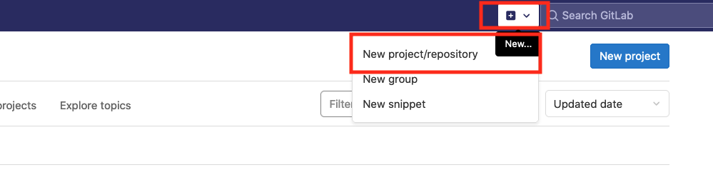
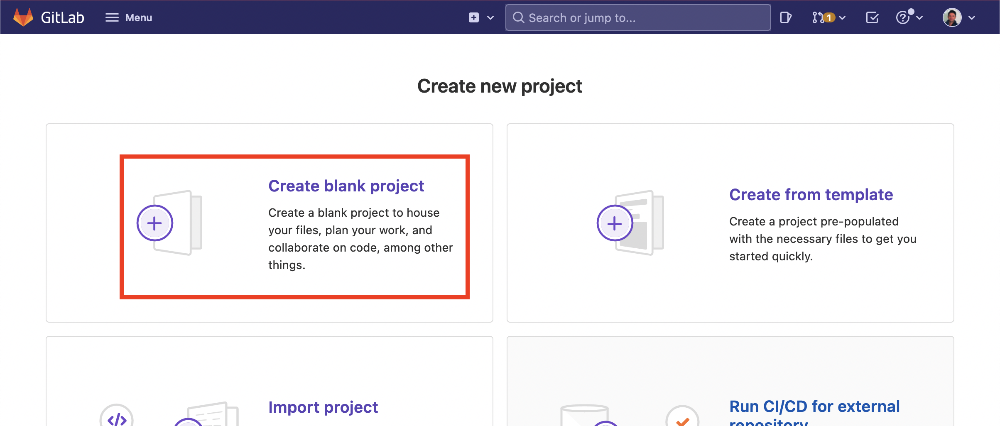
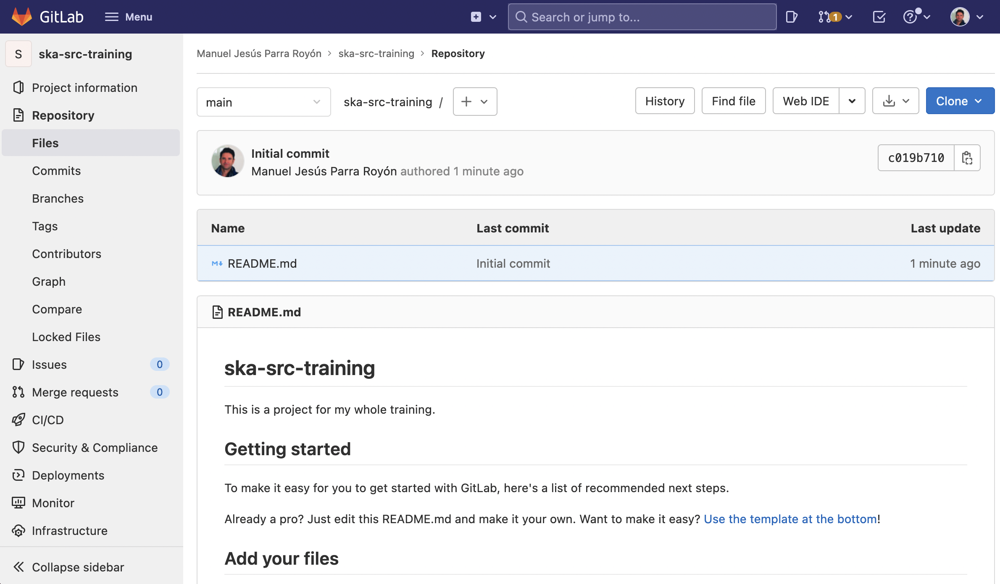

[[TOC]]

## Objectives and scope

In this section we will show how to use GitLab to share results with the community or your colleagues. You will be able to share code, text documents, figures or notebooks, which can be rendered automatically.

Overall steps: 

- Start an account
- Start a repository (Description, README, LICENSE)
- Upload / Add / Create files and folders
- Make changes to file and commit them
- View differences and history
- Share your work!

We will use GitLab, but there are other platforms that offer very similar services and work in almost the same way. We recommend you take a look at GitHub, and BitBucket as perfectly viable alternatives. 

## What is GitLab and how does it work

GitLab is a code hosting platform for version control and collaboration. It lets you and others work together on projects from anywhere. Developing your project or analysis collaboratively on GitLab or GitHub provides a prompter to document your work in detail and it provides a great opportunity to get additional contributors to your idea. Contributions can be everything from new ideas, to bug reports and actual code contributions.

The platform uses version control via git command, so you will have a complete history of all the changes for all the files, and when and who commited those changes. So no more files ending with `_v2_final_reviewed_Feb_finalfinal.pdf`. Additionally, you have an issue tracker to focus discussions on specific topics easy, a build-in wiki, and even space to host web pages.


## Starting

To start working with GitLab you need to have a GitLab user account, using any of the authentication methods provided. To proceed, visit 

- `https://gitlab.com/users/sign_in`

Once registered, you can create projects, repositories, open tickets, fork other repositories and share your work, among many other features.

## Welcome to GitLab

### Create a project

In GitLab, repositories are grouped by projects, so the first thing we need to create is a project that will host different related repositories.

To do this, from the Projects menu, select "New Project" or "Create new project":


Or from this top menu: 



After this, select *to create a new blank project*, to do that we are going to use the following data that will be used during all the training sessions: 




Now it is time to indicate the project details and the name of the repository. In the image below we include the project name, the short name, the project description and the visibility of the repository:

- Project name and project slug (i.e.): **ska-src-training**
- Type a description (i.e.): **"This is our repository for the SKA SRC Training".**
- Select Visibility Level (i.e.): **Public**


### Working with our repository

Once the repository has been created, the initial screen of the repository will display the following:



### Including our license

It is very important to add a licence to all your repositories. Public repositories on GitLab are often used to share open source software. For your repository to truly be open source, you'll need to license it so that others are free to use, change, and distribute the software, or your project.


Once here we can write the terms of our licence, but it is more appropriate to select a type of licence from one of the templates already available, so you can select the one that best suits the content to be distributed by the repository.


Then you must select **"Commit"** to save the newly included licence and the changes made to the repository.

We now return to the main screen of our repository.

### Adding content: Updating

By default the repository is created with a `README.md` file as an example. Whenever there is a `README.md` file in a directory in the repository, it will be taken as documentation or repository information. 

Now we are going to modify the `README.md` file so that it has other information related to our work. To do this, it is possible to edit the content of the stored files by selecting the file and clicking on *"Edit in Web IDE"*:


Here we include some textual information about the project and repository using a format called *MarkDown* to compose it (you can check the syntax [here](https://www.markdownguide.org/basic-syntax/) ).


After including some content, what we want to do is to save the work done so far, this is what we call a "Commit", so those changes are ready to be saved. By committing the "Commit", 


To identify the "Commit" it is essential to include a message giving a brief summary of the changes and to decide whether the changes will go to a new development branch or feature.


We go back to the repository home screen (by clicking name of the repository) and you can see the changes made.


### Adding content: New file

To include new files and directories we can do it from the web interface through the following feature:


There are several ways to include content from the web interface:

- **Add a new file**: From this option we can include content directly from the browser with a simple text editor, without having to use the "git" commands from the console.
- **Upload a new file**.
- **Create a new directory**: We can create a directory structure for our project and add files.


To add a new file including the content we use the "New File" option. From there we write in the browser the content of our file, in this case a file for a DockerFile. Docker can build images automatically by reading the instructions from a **Dockerfile**. A **Dockerfile** is a text document that contains all the commands a user could call on the command line to assemble an image. Using docker build users can create an automated build that executes several command-line instructions in succession. So to do that we will add the following content to the new file named `Dockerfile`:

```
FROM ubuntu:20.04
RUN apt-get update && apt-get install -y python3 python3-pip
RUN pip3 install matplotlib
RUN pip3 install scipy
RUN pip3 install numpy
RUN mkdir -p /code
COPY plot.py /code
WORKDIR /code
```

 

As usual, any changes we make must be followed by a **"Commit"** to save the changes up to this point. 

Now we add another file, this time with a code to plot a graph, which you will test later in the training. 

For this, we repeat the previous steps (add a new file) and include the following code to a file called `plot.py`:

```
import numpy as np
from scipy.interpolate import splprep, splev

import matplotlib.pyplot as plt
from matplotlib.path import Path
from matplotlib.patches import PathPatch

N = 400
t = np.linspace(0, 3 * np.pi, N)
r = 0.5 + np.cos(t)
x, y = r * np.cos(t), r * np.sin(t)
fig, ax = plt.subplots()
ax.plot(x, y)
plt.xlabel("X value")
plt.ylabel("Y value")
plt.savefig('testplot.png')
```

GitLab also allows you to include directories and create your own structure. Now we create a directory where we will store the project data files. We need to go back to the main repository screen and from there select to include the new repository. 

 

Now we include the downloaded data into the directory from the "Upload" option.

 

After including the datasets, we return to the initial screen of the repository and we should have the following structure created:

  


### Checking history versions

To review the versions we have, i.e. the commits that we have been doing throughout the time, we can view them from the option: 

  

Here are all the commits that have been made. If we want to check one in particular it is possible to see what changes have been made with respect to the previous one, by clicking on the commit description:

  

### Collaboration

A key element in developing work with version control platforms and tools is that they are designed for collaboration. To this end, we can add collaborating members with different profiles. To do this you can access from the side menu *Project -> Members*.

  

From the following screen we can add members to our repository by searching for them by e-mail or by user name. We can also select the role: *Guest*, *Reporter*, *Maintainer* or *Developer*.

  

You can try to include the user: **manuparra**


### Issue Tracker

The Issue Tracker is the place to add things that need to be improved or solved in a project that you are developing or that you are using. Issues can be bugs, tasks or ideas to be discussed. Also, issues are searchable and filterable. 

To access it, you can select from the left side menu Issues List:


Then, if it is the first issue to write, you can do it from the *New Issue* button:


The next screen is where you can include all the data of the Issue, from the name, description, issue assignment etc. to the deadline or weight of the issue.


After this you will see the list of Issues that have been created so far, with all their attributes.


